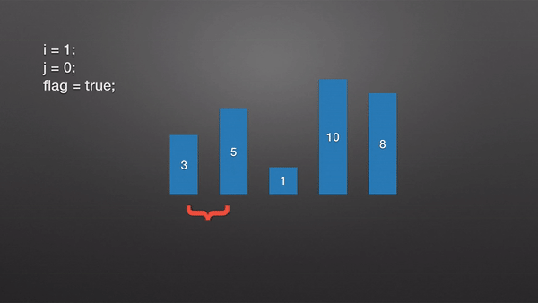

# 冒泡排序

冒泡排序（Bubble Sort）也是一种简单直观的排序算法。它重复地走访过要排序的数列，一次比较两个元素，如果他们的顺序错误就把他们交换过来。走访数列的工作是重复地进行直到没有再需要交换，也就是说该数列已经排序完成。这个算法的名字由来是因为越小的元素会经由交换慢慢“浮”到数列的顶端。

## 算法步骤

* 比较相邻的元素。如果第一个比第二个大，就交换他们两个。
* 对每一对相邻元素作同样的工作，从开始第一对到结尾的最后一对。这步做完后，最后的元素会是最大的数。
* 针对所有的元素重复以上的步骤，除了最后一个。
* 持续每次对越来越少的元素重复上面的步骤，直到没有任何一对数字需要比较。

## 动画演示



## java 代码实现

```java
/**
 * 描述: 冒泡排序
 *
 * @author Lin
 * @since 2019-08-03 1:51 PM
 */
public class BubbleSort implements IArraySort {
    @Override
    public int[] sort(int[] sourceArray) throws Exception {
        int[] array = Arrays.copyOf(sourceArray, sourceArray.length);

        for (int i = 1; i < array.length; i++) {
            boolean flag = true;
            for (int j = 0; j < array.length - i; j++) {
                if (array[j] > array[j + 1]) {
                    int tmp = array[j];
                    array[j] = array[j + 1];
                    array[j + 1] = tmp;
                    flag = false;
                }
            }

            if (flag) {
                break;
            }
        }

        return array;
    }

    public static void main(String[] args) throws Exception {
        System.out.println(Arrays.toString(new BubbleSort().sort(new int[]{3, 5, 1, 10, 8})));
    }
}
```