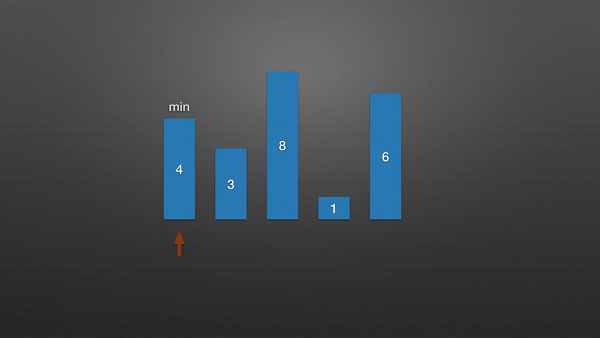

# 选择排序

选择排序是一种简单直观的排序算法，无论什么数据进去都是 O(n²) 的时间复杂度。所以用到它的时候，数据规模越小越好。唯一的好处可能就是不占用额外的内存空间。

## 算法步骤

* 首先在未排序序列中找到最小元素，存放到排序序列的起始位置
* 再从剩余未排序元素中继续寻找最小元素，然后放到已排序序列的末尾。
* 重复第二步，直到所有元素均排序完毕。

## 动画演示



## java 代码实现

```java
public class SelectionSort implements IArraySort {
    @Override
    public int[] sort(int[] sourceArray) throws Exception {
        int[] array = Arrays.copyOf(sourceArray, sourceArray.length);

        for (int i = 0; i < array.length; i++) {
            int min = i;

            for (int j = i + 1; j < array.length; j++) {
                if (array[j] < array[min]) {
                    min = j;
                }
            }

            if (i != min) {
                int tmp = array[i];
                array[i] = array[min];
                array[min] = tmp;
            }
        }

        return array;
    }

    public static void main(String[] args) throws Exception {
        System.out.println(Arrays.toString(new SelectionSort().sort(new int[]{10, 5, 3, 1, 9})));
    }
}
```